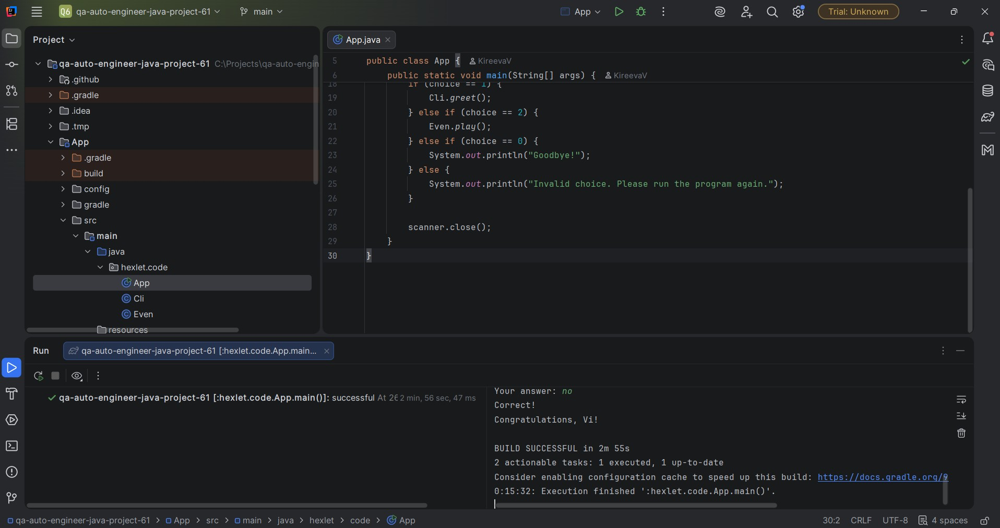

### Hexlet tests and linter status:

## Пример запуска игры "Проверка на чётность"

### Приветствие и первый вопрос

### Второй и третий вопрос

### Победа

### Неправильный ответ

### Выбор цифры 0
