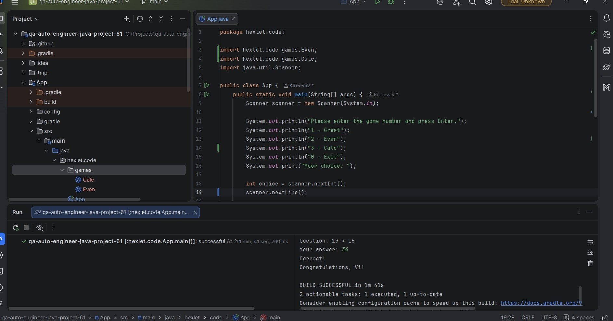
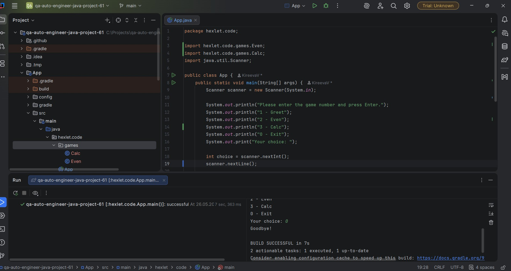
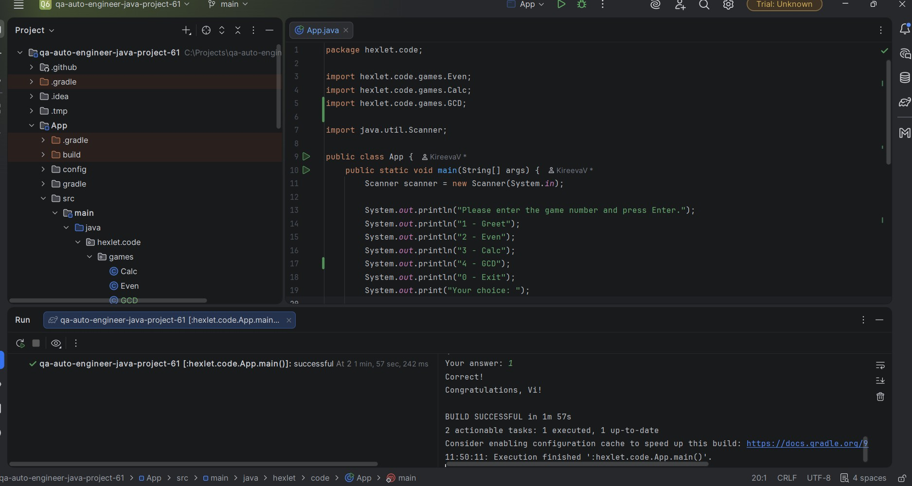
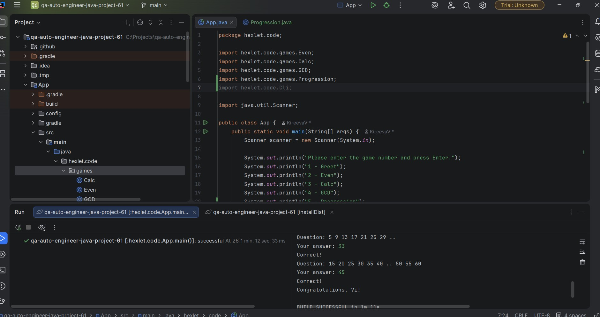
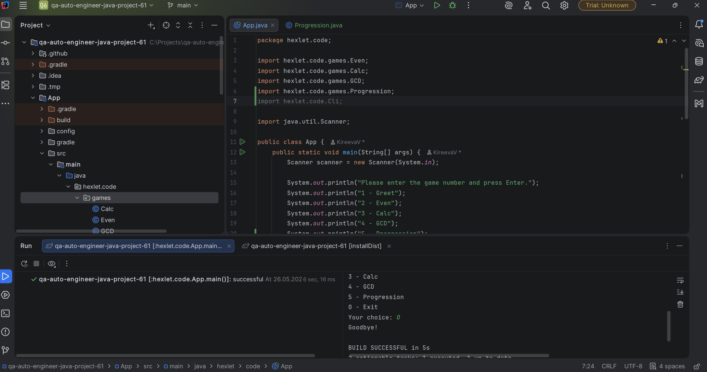
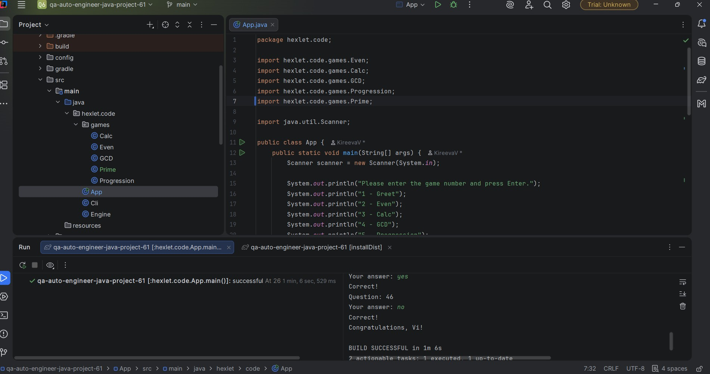

### Hexlet tests and linter status:

## Пример запуска игры "Проверка на чётность"

### Приветствие и первый вопрос

### Второй и третий вопрос

### Победа

### Неправильный ответ

### Выбор цифры 0

## Пример запуска игры "Калькулятор"

### Выбор игры, имя и первый вопрос

### Второй и третий вопрос

### Победа

### Неправильный ответ

### Выход

## Пример запуска игры "НОД"

### Выбор игры, имя и первый вопрос

### Второй и третий вопрос

### Победа

### Неправильный ответ

## Пример запуска игры "Арифметическая прогрессия"

### Выбор игры, имя и первый вопрос

### Победа

### Неправильный ответ

### Выход

## Пример запуска игры "Простое ли число?"

### Выбор игры, имя и первый вопрос

### Успех

### Неправильный ответ

### Выбор игры под номером 1

### Выбор игры под номером 2

### Выбор игры под номером 3

### Выбор игры под номером 4

### Выбор игры под номером 5
